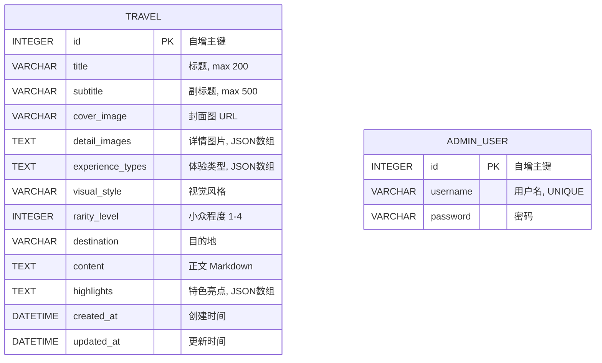

# ER 图

## 字段说明

### travel 表

| 字段 | 类型 | 说明 |
|------|------|------|
| id | INTEGER | 主键，自增 |
| title | VARCHAR(200) | 旅行标题 |
| subtitle | VARCHAR(500) | 副标题/简述 |
| cover_image | VARCHAR(1000) | 封面图片 URL |
| detail_images | TEXT | 详情图片列表，JSON 数组格式 |
| experience_types | TEXT | 体验类型，JSON 数组格式 |
| visual_style | VARCHAR(50) | 视觉风格 |
| rarity_level | INTEGER | 小众程度，1-4 |
| destination | VARCHAR(200) | 目的地 |
| content | TEXT | 正文内容（Markdown） |
| highlights | TEXT | 特色亮点，JSON 数组格式 |
| created_at | DATETIME | 创建时间，自动填充 |
| updated_at | DATETIME | 更新时间，自动更新 |

### admin_user 表

| 字段 | 类型 | 说明 |
|------|------|------|
| id | INTEGER | 主键，自增 |
| username | VARCHAR(50) | 用户名，唯一 |
| password | VARCHAR(200) | 密码（明文，MVP阶段） |

## 枚举值

### experience_types

| 编码 | 名称 | 图标 |
|------|------|------|
| extreme | 极限探险 | 🧗 |
| culture | 文化沉浸 | 🎭 |
| hidden | 秘境探索 | 🗺️ |
| eco | 生态旅行 | 🌿 |
| urban | 城市隐世 | 🏙️ |
| taste | 味觉之旅 | 🍜 |

### visual_style

| 编码 | 名称 |
|------|------|
| minimal | 极简 |
| cinematic | 电影感 |
| vintage | 复古胶片 |
| vivid | 高饱和冲击 |
| bw | 黑白纪实 |
| natural | 自然光 |
