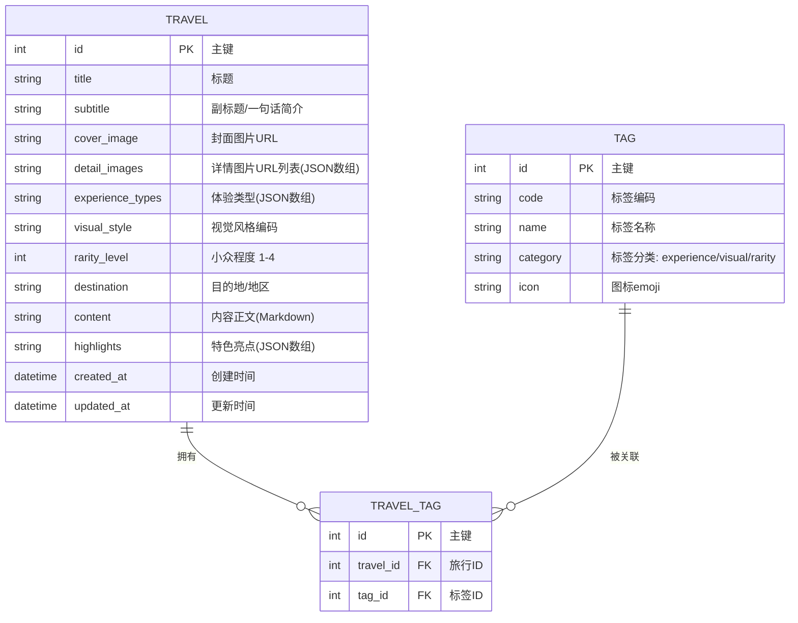
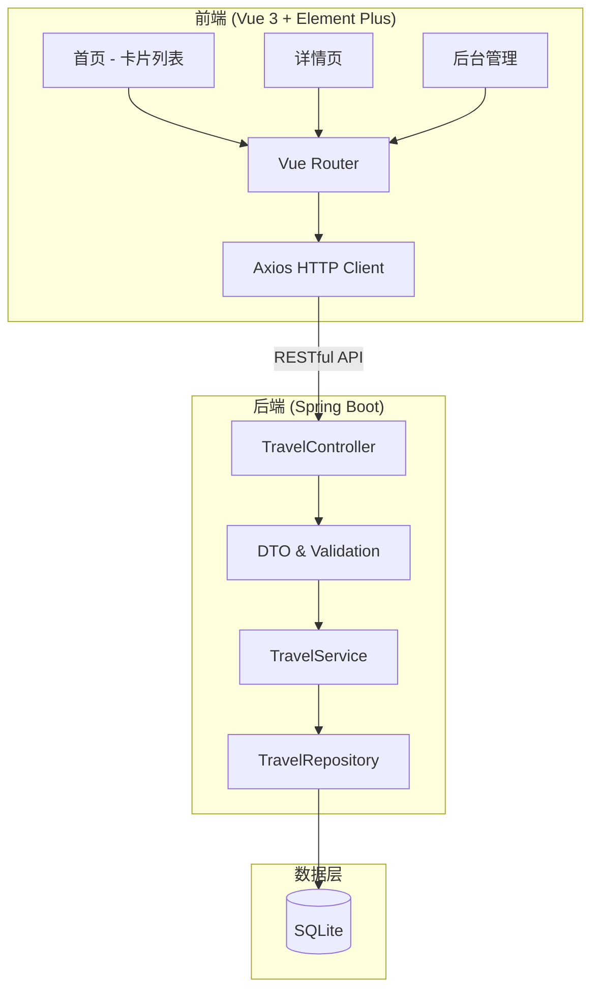
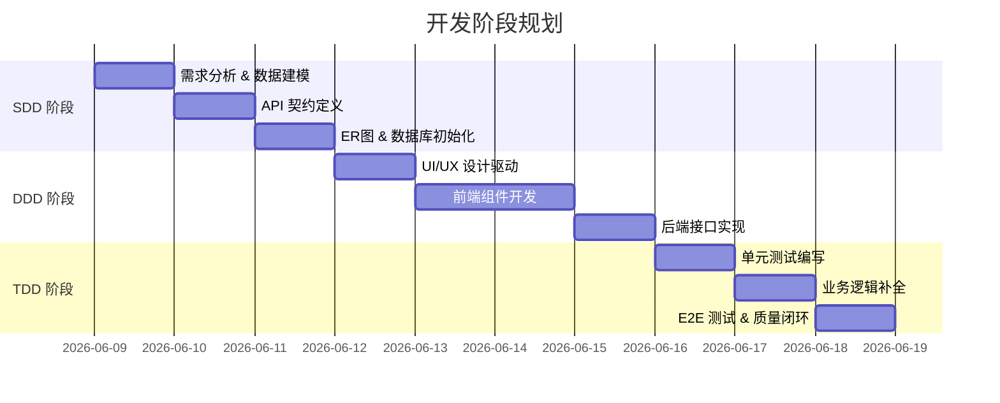

# 「100种不可思议旅行」需求规格说明书 (PRD)

> **版本**: v1.0  
> **日期**: 2026-06-09  
> **状态**: 草稿  
> **作者**: AI 开发实习生  

---

## 目录

1. [项目概述](#1-项目概述)
2. [业务需求](#2-业务需求)
3. [功能需求](#3-功能需求)
4. [内容分类体系](#4-内容分类体系)
5. [数据模型](#5-数据模型)
6. [API 接口设计](#6-api-接口设计)
7. [UI/UX 设计方向](#7-uiux-设计方向)
8. [技术架构](#8-技术架构)
9. [开发流程与范式](#9-开发流程与范式)
10. [测试策略](#10-测试策略)
11. [交付物清单](#11-交付物清单)
12. [附录：Skill 与 MCP 推荐](#12-附录skill-与-mcp-推荐)

---

## 1. 项目概述

### 1.1 项目名称

**「100种不可思议旅行」- 轻量级内容展示 Web App MVP**

### 1.2 产品定位

"飞猪旅行"旗下子品牌，打造一个极致小众、视觉冲击强、非主流旅行方式的内容展示平台。

**核心价值主张**: 发现那些"你从未想过可以这样旅行"的独特体验，为追求个性化、差异化旅行方式的用户提供灵感与发现渠道。

### 1.3 项目目标

从 0 到 1 构建一个极简但有生产级质感的内容展示 MVP，完整跑通 **SDD → DDD → TDD** 三阶段工程化开发流程。

### 1.4 项目范围

| 维度 | 范围 |
|------|------|
| **前端** | 内容浏览首页、详情页、多维度筛选、后台管理界面 |
| **后端** | RESTful API、数据持久化、内容管理接口 |
| **数据** | ≥5条高质量示例数据、SQLite 数据库 |
| **测试** | 单元测试 + E2E 测试 |
| **文档** | PRD、ER图、API文档、README、Prompt记录、工作流说明 |

---

## 2. 业务需求

### 2.1 目标用户画像

| 用户群体 | 特征描述 | 核心诉求 |
|----------|----------|----------|
| **95后-00后 Z世代** | 数字原住民、追求个性表达、乐于分享 | 寻找能彰显个性的独特旅行方式，获得社交货币 |
| **反常规生活方式追求者** | 拒绝千篇一律、追求深度体验、注重精神满足 | 发现真正有深度、有意义的旅行体验 |
| **视觉系内容消费者** | 注重审美体验、喜欢高质量图片/视频 | 获得视觉享受，发现"值得打卡"的目的地 |

### 2.2 用户痛点

1. **同质化严重**: 传统旅行 App 推荐内容千篇一律，热门景点、网红打卡地重复率高
2. **发现效率低**: 真正独特的小众玩法散落在各平台，缺乏聚合入口
3. **情绪共鸣缺失**: 内容偏功能性介绍，缺乏情感连接和故事性
4. **筛选维度单一**: 难以按"体验类型"、"视觉风格"、"小众程度"等个性化维度筛选

### 2.3 核心功能需求（用户故事）

| ID | 作为... | 我想要... | 以便... |
|----|---------|-----------|---------|
| US-01 | 内容消费者 | 在首页浏览旅行卡片列表 | 快速发现感兴趣的独特旅行体验 |
| US-02 | 内容消费者 | 按体验类型筛选内容 | 找到符合我偏好的旅行方式 |
| US-03 | 内容消费者 | 按视觉风格筛选内容 | 获得符合我审美的视觉体验 |
| US-04 | 内容消费者 | 按小众程度筛选内容 | 发现真正冷门的旅行体验 |
| US-05 | 内容消费者 | 查看旅行详情页 | 全面了解某个旅行体验的细节 |
| US-06 | 内容管理员 | 在后台添加/编辑旅行内容 | 维护和更新平台内容 |
| US-07 | 内容管理员 | 删除过期或不当内容 | 保持平台内容质量 |

---

## 3. 功能需求

### 3.1 前台功能模块

#### 3.1.1 首页（旅行卡片列表）

- **卡片网格布局**: 响应式网格，桌面端 3-4 列，移动端 1-2 列
- **每张卡片展示**:
  - 封面图片（主视觉）
  - 旅行标题
  - 体验类型标签
  - 小众程度指示
  - 一句话简介（副标题）
- **筛选栏**（顶部或侧边）:
  - 体验类型：多选标签
  - 视觉风格：单选/多选
  - 小众程度：范围选择
- **加载方式**: 首次加载前 20 条，滚动加载更多（MVP 阶段可直接全量展示）

#### 3.1.2 详情页

- **主图展示区**: 大图或轮播图
- **基本信息**:
  - 标题
  - 体验类型
  - 视觉风格
  - 小众程度
  - 目的地/地区
- **内容正文**: 富有故事性的文字描述
- **特色亮点**: 3-5 个关键亮点标签
- **返回按钮**: 返回首页并保持筛选状态

#### 3.1.3 筛选系统

| 筛选维度 | 控件类型 | 说明 |
|----------|----------|------|
| 体验类型 | 多选标签 (Chips) | 可同时选择多个类型 |
| 视觉风格 | 单选标签组 | 一次选择一个风格 |
| 小众程度 | 滑块或分段选择器 | 1-4 级小众程度 |

### 3.2 后台管理功能模块

#### 3.2.1 内容列表管理

- 表格展示所有旅行内容
- 支持按标题搜索
- 显示创建时间、更新时间
- 操作按钮：编辑、删除

#### 3.2.2 内容编辑/新增

- **表单字段**:
  - 标题（必填）
  - 副标题/一句话简介（必填）
  - 封面图片 URL（必填）
  - 详情图片 URL 列表
  - 体验类型（必填，多选）
  - 视觉风格（必填，单选）
  - 小众程度（必填，1-4）
  - 目的地/地区（必填）
  - 内容正文（必填）
  - 特色亮点标签（可选，多个）
- **图片预览**: 输入 URL 后实时预览
- **表单验证**: 前端 + 后端双重校验

---

## 4. 内容分类体系

> **说明**: 以下为建议方案，由需求文档基于业务场景推导，可在开发过程中调整。

### 4.1 体验类型（多选）

| 编码 | 类型 | 描述 | 示例 |
|------|------|------|------|
| `extreme` | 🧗 极限探险 | 挑战身体与心理极限 | 火山口滑板、冰川攀冰、翼装飞行 |
| `culture` | 🎭 文化沉浸 | 深度融入当地文化 | 蒙古草原游牧、日本寺庙禅修、摩洛哥集市学徒 |
| `hidden` | 🗺️ 秘境探索 | 人迹罕至的隐秘之地 | 北极光冰屋、亚马逊树冠漫步、沙漠无人区 |
| `eco` | 🌿 生态旅行 | 与自然和谐共处 | 哥斯达黎加树懒保护区、南极生态科考 |
| `urban` | 🏙️ 城市隐世 | 在城市中寻找非主流体验 | 东京地下音乐场景、伦敦屋顶花园巡礼 |
| `taste` | 🍜 味觉之旅 | 以食物为线索的旅行 | 泰国街头米其林、意大利松露狩猎 |

### 4.2 视觉风格（单选）

| 编码 | 风格 | 色调特征 |
|------|------|----------|
| `minimal` | 极简 | 低饱和、大量留白、干净构图 |
| `cinematic` | 电影感 | 暗调、Teal & Orange 调色、宽画幅 |
| `vintage` | 复古胶片 | 暖黄、颗粒感、褪色效果 |
| `vivid` | 高饱和冲击 | 鲜艳色彩、强对比、HDR 风格 |
| `bw` | 黑白纪实 | 纯黑白、强调光影和结构 |
| `natural` | 自然光 | 柔和自然光、低反差、真实色彩 |

### 4.3 小众程度（1-4 级）

| 级别 | 名称 | 描述 |
|------|------|------|
| ⭐ | 热门新宠 | 已有一定知名度但尚未泛滥 |
| ⭐⭐ | 小众精选 | 圈内人知道的玩法 |
| ⭐⭐⭐ | 秘境发现 | 极少人知道的体验 |
| ⭐⭐⭐⭐ | 极致冷门 | 全球可能只有几百人体验过 |

---

## 5. 数据模型

### 5.1 ER 图



### 5.2 数据库表设计

#### travel 表（核心业务表）

| 字段 | 类型 | 约束 | 说明 |
|------|------|------|------|
| `id` | INTEGER | PK, AUTOINCREMENT | 主键 |
| `title` | VARCHAR(200) | NOT NULL | 标题 |
| `subtitle` | VARCHAR(500) | NOT NULL | 副标题/一句话简介 |
| `cover_image` | VARCHAR(1000) | NOT NULL | 封面图片 URL |
| `detail_images` | TEXT | NULLABLE | 详情图片 URL 列表，JSON 数组 |
| `experience_types` | TEXT | NOT NULL | 体验类型编码，JSON 数组 |
| `visual_style` | VARCHAR(50) | NOT NULL | 视觉风格编码 |
| `rarity_level` | INTEGER | NOT NULL, 1-4 | 小众程度 |
| `destination` | VARCHAR(200) | NOT NULL | 目的地/地区 |
| `content` | TEXT | NOT NULL | 内容正文（Markdown 格式） |
| `highlights` | TEXT | NULLABLE | 特色亮点标签，JSON 数组 |
| `created_at` | DATETIME | DEFAULT CURRENT_TIMESTAMP | 创建时间 |
| `updated_at` | DATETIME | DEFAULT CURRENT_TIMESTAMP | 更新时间 |

### 5.3 示例数据（≥5 条）

| # | 标题 | 体验类型 | 视觉风格 | 小众程度 |
|---|------|----------|----------|----------|
| 1 | 冰岛火山内部探险：穿越地心之门 | 极限探险 | 电影感 | ⭐⭐⭐ |
| 2 | 在日本寺庙与僧侣共修七日 | 文化沉浸 | 极简 | ⭐⭐ |
| 3 | 西伯利亚驯鹿牧民的冬季迁徙 | 秘境探索 | 黑白纪实 | ⭐⭐⭐⭐ |
| 4 | 意大利阿尔巴的白松露狩猎之旅 | 味觉之旅 | 复古胶片 | ⭐⭐ |
| 5 | 新加坡城市天际线隐藏的屋顶农场 | 城市隐世 | 自然光 | ⭐ |

---

## 6. API 接口设计

### 6.1 RESTful API 总览

| 方法 | 路径 | 说明 | 场景 |
|------|------|------|------|
| `GET` | `/api/travels` | 获取旅行列表（支持筛选） | 前台首页 |
| `GET` | `/api/travels/{id}` | 获取旅行详情 | 前台详情页 |
| `POST` | `/api/admin/travels` | 新增旅行内容 | 后台新增 |
| `PUT` | `/api/admin/travels/{id}` | 更新旅行内容 | 后台编辑 |
| `DELETE` | `/api/admin/travels/{id}` | 删除旅行内容 | 后台删除 |
| `GET` | `/api/tags` | 获取所有标签 | 筛选选项 |

### 6.2 接口详细设计

#### GET /api/travels

**查询参数**:

| 参数 | 类型 | 必填 | 说明 |
|------|------|------|------|
| `experience_type` | string | 否 | 体验类型编码，多选用逗号分隔 |
| `visual_style` | string | 否 | 视觉风格编码 |
| `rarity_level` | int | 否 | 最小小众程度，返回 ≥ 此值的结果 |
| `page` | int | 否 | 页码，默认 1 |
| `size` | int | 否 | 每页条数，默认 20 |

**响应示例**:
```json
{
  "code": 200,
  "data": {
    "total": 100,
    "page": 1,
    "size": 20,
    "list": [
      {
        "id": 1,
        "title": "冰岛火山内部探险：穿越地心之门",
        "subtitle": "深入休眠火山的岩浆房，体验地球脉搏",
        "coverImage": "https://example.com/volcano.jpg",
        "experienceTypes": ["extreme", "hidden"],
        "visualStyle": "cinematic",
        "rarityLevel": 3,
        "destination": "冰岛·雷克雅未克",
        "highlights": ["唯一可进入火山内部的地方", "下降120米", "地质奇观"],
        "createdAt": "2026-06-01T10:00:00Z"
      }
    ]
  },
  "message": "success"
}
```

#### GET /api/travels/{id}

**响应示例**:
```json
{
  "code": 200,
  "data": {
    "id": 1,
    "title": "冰岛火山内部探险：穿越地心之门",
    "subtitle": "深入休眠火山的岩浆房，体验地球脉搏",
    "coverImage": "https://example.com/volcano.jpg",
    "detailImages": ["https://example.com/volcano1.jpg", "https://example.com/volcano2.jpg"],
    "experienceTypes": ["extreme", "hidden"],
    "visualStyle": "cinematic",
    "rarityLevel": 3,
    "destination": "冰岛·雷克雅未克",
    "content": "## 关于这次旅行\n\n...（Markdown正文）",
    "highlights": ["唯一可进入火山内部的地方", "下降120米", "地质奇观"],
    "createdAt": "2026-06-01T10:00:00Z",
    "updatedAt": "2026-06-01T10:00:00Z"
  },
  "message": "success"
}
```

#### POST /api/admin/travels

**请求体**:
```json
{
  "title": "string (必填, max 200)",
  "subtitle": "string (必填, max 500)",
  "coverImage": "string (必填, URL格式)",
  "detailImages": ["string (URL格式)"],
  "experienceTypes": ["extreme", "hidden"],
  "visualStyle": "cinematic",
  "rarityLevel": 3,
  "destination": "string (必填, max 200)",
  "content": "string (必填, Markdown格式)",
  "highlights": ["string"]
}
```

**统一响应格式**:
```json
{
  "code": 200,
  "data": {},
  "message": "success"
}
```

**错误码设计**:

| 错误码 | 说明 |
|--------|------|
| 200 | 成功 |
| 400 | 参数校验失败 |
| 404 | 资源不存在 |
| 500 | 服务器内部错误 |

---

## 7. UI/UX 设计方向

### 7.1 设计原则

- **视觉优先**: 大图主导，文字精简，让图片讲故事
- **沉浸式浏览**: 减少操作摩擦，滚动即发现
- **情感共鸣**: 配色和排版传达探索感和神秘感
- **移动优先**: 先设计移动端，再扩展桌面端

### 7.2 UI 组件库选型

**推荐: Element Plus**

| 对比维度 | Element Plus | Ant Design Vue | Naive UI |
|----------|-------------|----------------|----------|
| Vue 3 支持 | ✅ 原生支持 | ✅ 支持 | ✅ 原生支持 |
| 中文生态 | ✅ 最成熟 | ✅ 成熟 | ⚠️ 一般 |
| 组件丰富度 | ✅ 80+ 组件 | ✅ 70+ 组件 | ✅ 70+ 组件 |
| 社区活跃度 | ⭐⭐⭐⭐⭐ | ⭐⭐⭐⭐ | ⭐⭐⭐ |
| 文档质量 | 中文完善 | 中文完善 | 中文较少 |
| Bundle 体积 | 较大(Tree-shaking) | 较大(Tree-shaking) | 较小 |

**选型理由**: Element Plus 是 Vue 3 生态中最成熟的企业级组件库，中文文档完善，社区活跃，且与 Spring Boot 后台管理场景契合度高。

### 7.3 页面结构

```
├── 前台
│   ├── 首页 (/)
│   │   ├── 顶部导航栏 (Logo + 标题)
│   │   ├── 筛选栏 (体验类型 / 视觉风格 / 小众程度)
│   │   └── 卡片网格 (旅行卡片 × N)
│   └── 详情页 (/travel/:id)
│       ├── 封面大图
│       ├── 基本信息区
│       ├── 内容正文区 (Markdown 渲染)
│       └── 返回按钮
│
└── 后台 (/admin)
    ├── 内容列表页 (/admin/travels)
    │   ├── 搜索栏
    │   ├── 数据表格
    │   └── 新增按钮
    └── 编辑页 (/admin/travels/:id)
        └── 表单
```

### 7.4 配色方案（建议）

| 用途 | 色值 | 说明 |
|------|------|------|
| 主色 | `#1a1a2e` | 深蓝黑，传达神秘感 |
| 辅色 | `#e94560` | 珊瑚红，点睛色 |
| 背景色 | `#fafafa` | 浅灰白，干净底色 |
| 卡片背景 | `#ffffff` | 白色卡片 |
| 文字主色 | `#2d3436` | 深灰 |
| 文字辅色 | `#636e72` | 中灰 |
| 标签色 | 按类型分配 | 每种体验类型一个颜色 |

---

## 8. 技术架构

### 8.1 技术栈

| 层级 | 技术选型 | 版本 | 说明 |
|------|----------|------|------|
| **前端框架** | Vue 3 | 3.x | Composition API + `<script setup>` |
| **UI 组件库** | Element Plus | 2.x | 企业级 Vue 3 组件库 |
| **构建工具** | Vite | 5.x | 快速 HMR，开发体验好 |
| **路由** | Vue Router | 4.x | SPA 路由 |
| **HTTP 客户端** | Axios | 1.x | 请求拦截、错误处理 |
| **Markdown 渲染** | marked + highlight.js | - | 内容正文渲染 |
| **后端框架** | Spring Boot | 3.x | Java 生态标准 |
| **数据库** | SQLite | 3.x | 轻量级，零配置 |
| **ORM** | Spring Data JPA / MyBatis-Plus | - | 数据库操作 |
| **API 文档** | SpringDoc OpenAPI | 2.x | Swagger UI |
| **测试框架(后端)** | JUnit 5 + Mockito | - | 单元测试 |
| **测试框架(前端)** | Vitest + Vue Test Utils | - | 组件测试 |
| **E2E 测试** | Playwright | 1.x | 端到端测试 |

### 8.2 项目结构

```
100-incredible-travels/
├── frontend/                    # Vue 3 前端项目
│   ├── src/
│   │   ├── api/                 # API 请求封装
│   │   ├── components/          # 公共组件
│   │   ├── views/               # 页面组件
│   │   │   ├── Home.vue         # 首页
│   │   │   ├── TravelDetail.vue # 详情页
│   │   │   └── admin/           # 后台页面
│   │   ├── router/              # 路由配置
│   │   ├── stores/              # Pinia 状态管理
│   │   ├── styles/              # 全局样式
│   │   └── utils/               # 工具函数
│   ├── package.json
│   └── vite.config.ts
│
├── backend/                     # Spring Boot 后端项目
│   ├── src/main/java/
│   │   └── com/travel/
│   │       ├── controller/      # 控制器
│   │       ├── service/         # 业务逻辑
│   │       ├── repository/      # 数据访问
│   │       ├── entity/          # 实体类
│   │       ├── dto/             # 数据传输对象
│   │       └── config/          # 配置类
│   ├── src/main/resources/
│   │   ├── application.yml      # 应用配置
│   │   └── db/
│   │       └── data.sql         # 初始化数据脚本
│   ├── src/test/                # 测试代码
│   └── pom.xml
│
├── docs/                        # 文档
│   ├── PRD.md                   # 本需求文档
│   ├── ER图.md                  # ER 图
│   ├── API文档.md               # API 文档
│   └── Prompt记录.md            # 核心 Prompt 记录
│
├── e2e/                         # E2E 测试
│   └── tests/
│
└── README.md
```

### 8.3 架构图



---

## 9. 开发流程与范式

### 9.1 三阶段开发流程



### 9.2 各阶段说明

#### 阶段一：SDD（Spec/Schema-Driven Development）

**目标**: 基于业务需求，精确定义数据模型与 API 契约。

- 输出 ER 图（Mermaid）
- 输出 API 契约（请求/响应格式）
- 创建数据库初始化脚本
- 编写 DDL 和示例数据

**使用工具**: `brainstorming` skill → `writing-plans` skill → 手写 Schema

#### 阶段二：DDD（Design-Driven Development）

**目标**: 使用 UI UX Pro Max，以视觉和交互设计驱动前端组件与状态流转。

- 基于设计原则确定配色、排版、间距
- 从设计稿/设计系统生成前端组件
- 先组件后页面，自底向上构建

**使用工具**: `ui-ux-pro-max` skill 驱动组件设计

#### 阶段三：TDD（Test-Driven Development）

**目标**: 严格遵循测试驱动流程，先写测试，再写实现。

- 后端：Service 层单元测试 → 实现 → Controller 层集成测试 → 实现
- 前端：组件单元测试 → 实现
- E2E：Playwright 端到端测试覆盖核心用户流程

**使用工具**: `test-driven-development` skill + `code-review` skill + `verify` skill

### 9.3 Git 提交规范

```
docs/schema:   数据模型与 ER 图
docs/api:      API 契约定义
ui/components: 前端组件开发
ui/pages:      页面组装
feat/logic:    后端业务逻辑
test/unit:     单元测试
test/e2e:      E2E 测试
docs/readme:   文档更新
```

---

## 10. 测试策略

### 10.1 测试金字塔

```
       ╱  E2E  ╲          ← 3 条核心流程
      ╱──────────╲
     ╱  集成测试   ╲        ← API 端点测试
    ╱──────────────╲
   ╱    单元测试     ╲      ← Service/组件逻辑
  ╱──────────────────╲
```

### 10.2 测试清单

| 层级 | 测试内容 | 工具 | 最低覆盖 |
|------|----------|------|----------|
| **后端单元测试** | TravelService 业务逻辑、DTO 校验 | JUnit 5 + Mockito | ≥ 80% |
| **后端集成测试** | API 端点请求/响应、数据库操作 | Spring Boot Test | 全部端点 |
| **前端组件测试** | 卡片组件、筛选组件、表单组件 | Vitest + Vue Test Utils | 核心组件 |
| **E2E 测试** | 首页浏览、筛选、详情查看、后台新增 | Playwright | 3 条核心流程 |

### 10.3 E2E 测试场景

| ID | 场景 | 步骤 |
|----|------|------|
| E2E-01 | 用户浏览首页并筛选 | 打开首页 → 选择"极限探险" → 验证卡片过滤 → 选择小众程度 ≥ 3 → 验证结果 |
| E2E-02 | 用户查看旅行详情 | 从首页点击卡片 → 进入详情页 → 验证图片、标题、正文 → 返回首页 |
| E2E-03 | 管理员新增内容 | 访问后台 → 点击新增 → 填写表单 → 提交 → 在前台验证新内容出现 |

---

## 11. 交付物清单

| # | 交付物 | 格式 | 状态 |
|---|--------|------|------|
| 1 | 完整项目源码 | GitHub/Gitee 仓库 | ⬜ 待开发 |
| 2 | 数据库初始化脚本 | SQL | ⬜ |
| 3 | ≥5 条高质量样例数据 | SQL/JSON | ⬜ |
| 4 | PRD（本需求文档） | Markdown | ✅ 已完成 |
| 5 | ER 图 | Mermaid in Markdown | ✅ 已包含 |
| 6 | API 文档 | SpringDoc + Markdown | ⬜ |
| 7 | 测试代码 | Java/JS | ⬜ |
| 8 | README | Markdown | ⬜ |
| 9 | 核心 Prompt 记录（≥5段） | Markdown | ⬜ |
| 10 | 开发过程思路 & 工作流说明 (1-1.5页) | Markdown/PDF | ⬜ |
| 11 | Git 提交历史 | Git Log | ⬜ |

---

## 12. 附录：Skill 与 MCP 推荐

### 12.1 已安装的 Claude Code Skills

| Skill | 来源 | 用途 | 使用阶段 |
|-------|------|------|----------|
| `using-superpowers` | obra/superpowers | 技能发现与使用引导 | 全流程 |
| `brainstorming` | obra/superpowers | 创意阶段需求探索与设计脑暴 | SDD 前期 |
| `writing-plans` | obra/superpowers | 多步骤任务规划 | 各阶段启动 |
| `ui-ux-pro-max` | sickn33/antigravity-awesome-skills | 设计驱动的 UI/UX 组件开发 | DDD 阶段 |
| `test-driven-development` | obra/superpowers | TDD 测试驱动开发流程 | TDD 阶段 |
| `systematic-debugging` | obra/superpowers | 系统化调试方法论 | 全流程 |
| `requesting-code-review` | obra/superpowers | 代码审查请求 | TDD/E2E 阶段 |
| `spring-boot` | mindrally/skills | Spring Boot 最佳实践 | 后端开发 |
| `context-map` | 内置 | 生成相关文件地图 | 全流程 |
| `code-review` | 内置 | 代码审查 | 各阶段末尾 |
| `verify` | 内置 | 验证改动效果 | TDD/E2E 阶段 |
| `simplify` | 内置 | 代码简化与重构 | 收尾阶段 |

### 12.2 推荐的 MCP (Model Context Protocol)

| MCP | 用途 | 优先级 |
|-----|------|--------|
| **SQLite MCP** | 直接操作 SQLite 数据库，快速验证数据模型 | 🔴 高 |
| **GitHub MCP** | 管理仓库、规范提交、创建 Release | 🔴 高 |
| **Filesystem MCP** | 批量文件操作、项目骨架搭建 | 🟡 中 |
| **Playwright MCP** | E2E 测试自动化，浏览器操作 | 🟡 中 |

### 12.3 安装命令参考

```bash
# MCP 安装（在 Claude Code 中通过 /mcp 命令添加）
# SQLite MCP
npx @anthropic/mcp-sqlite

# GitHub MCP  
npx @anthropic/mcp-github

# 已安装的 Skills（无需重复执行）
# npx skills add obra/superpowers@using-superpowers -g -y
# npx skills add sickn33/antigravity-awesome-skills@ui-ux-pro-max -g -y
# npx skills add mindrally/skills@spring-boot -g -y
```

---

> **文档状态**: 待评审  
> **下一步**: 进入 SDD 阶段 —— 基于本文档进行数据建模与 API 契约精确定义
