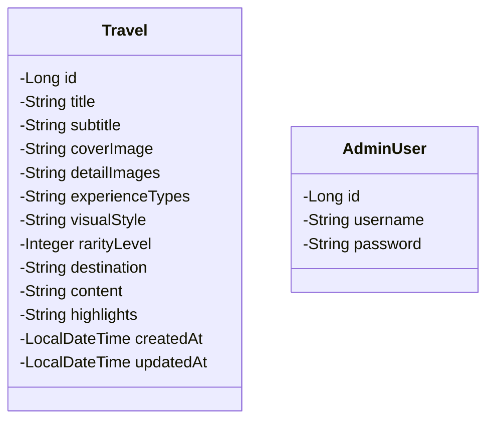
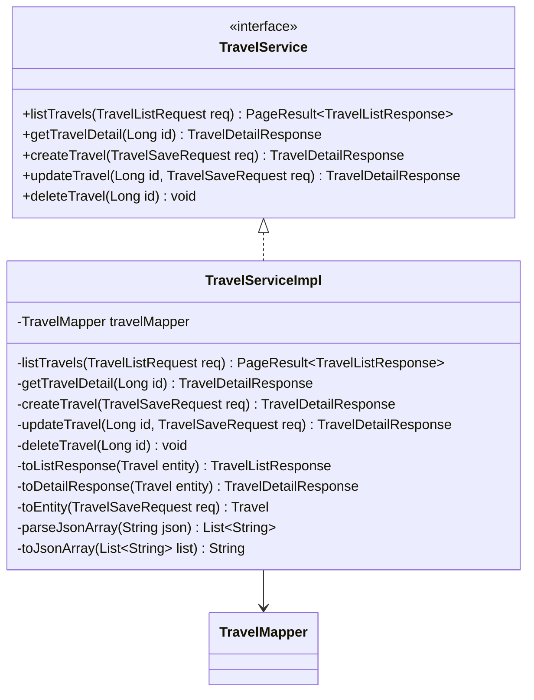
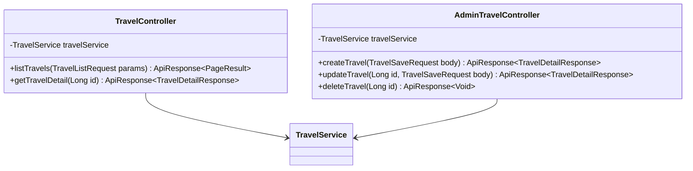
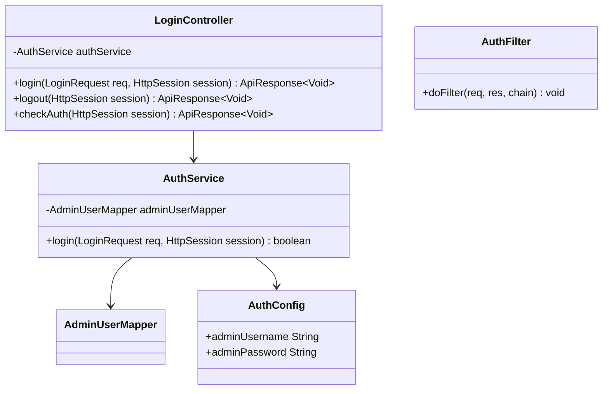
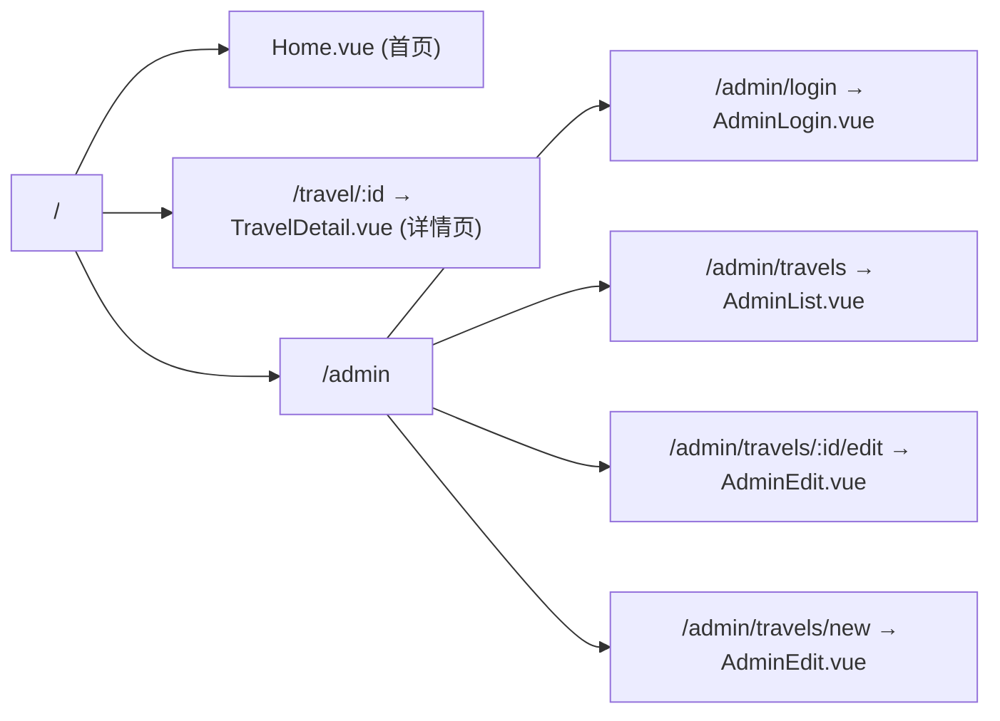

# 「100种不可思议旅行」详细设计文档

> **版本**: v1.0
> **日期**: 2026-06-09
> **状态**: 草稿
> **基于**: [01-需求规格说明书](./01-需求规格说明书.md)

---

## 目录

1. [概述与架构决策](#1-概述与架构决策)
2. [模块划分总览](#2-模块划分总览)
3. [后端模块设计](#3-后端模块设计)
   - [3.1 数据实体模块 `travel-entity`](#31-数据实体模块-travel-entity)
   - [3.2 数据传输对象模块 `travel-dto`](#32-数据传输对象模块-travel-dto)
   - [3.3 数据访问模块 `travel-mapper`](#33-数据访问模块-travel-mapper)
   - [3.4 业务逻辑模块 `travel-service`](#34-业务逻辑模块-travel-service)
   - [3.5 API 控制器模块 `travel-controller`](#35-api-控制器模块-travel-controller)
   - [3.6 认证模块 `admin-auth`](#36-认证模块-admin-auth)
   - [3.7 配置模块 `travel-config`](#37-配置模块-travel-config)
4. [前端模块设计](#4-前端模块设计)
   - [4.1 HTTP 客户端模块 `api-client`](#41-http-客户端模块-api-client)
   - [4.2 路由模块 `router`](#42-路由模块-router)
   - [4.3 旅行卡片组件 `TravelCard`](#43-旅行卡片组件-travalcard)
   - [4.4 筛选栏组件 `FilterBar`](#44-筛选栏组件-filterbar)
   - [4.5 首页模块 `Home`](#45-首页模块-home)
   - [4.6 详情页模块 `TravelDetail`](#46-详情页模块-travaldetail)
   - [4.7 后台登录模块 `AdminLogin`](#47-后台登录模块-adminlogin)
   - [4.8 后台列表模块 `AdminList`](#48-后台列表模块-adminlist)
   - [4.9 后台编辑模块 `AdminEdit`](#49-后台编辑模块-adminedit)
   - [4.10 公共组件模块 `CommonComponents`](#410-公共组件模块-commoncomponents)
5. [模块间接口契约](#5-模块间接口契约)
6. [测试策略](#6-测试策略)

---

## 1. 概述与架构决策

### 1.1 文档目的

本文档对「100种不可思议旅行」MVP 进行模块级详细设计。每个模块明确定义：
- **职责边界**：该模块负责什么，不负责什么
- **对外接口**：类/方法签名、组件 props/events、API 契约
- **内部实现要点**：关键逻辑、数据结构、依赖关系
- **独立测试方式**：如何在不启动完整应用的情况下验证该模块

### 1.2 关键架构决策记录 (ADR)

| # | 决策点 | 选择 | 理由 |
|---|--------|------|------|
| ADR-01 | ORM 框架 | **MyBatis-Plus** | 更灵活的 SQL 控制；Lambda 查询包装器减少硬编码；分页插件开箱即用 |
| ADR-02 | 标签体系 | **仅用 JSON 数组** | MVP 阶段标签体系稳定，JSON 存储避免多表联查；`experience_types`、`highlights` 用 TEXT 字段存 JSON 数组 |
| ADR-03 | 后台认证 | **简单固定账号** | 单用户管理场景，不需要注册/找回密码/JWT；使用 Session + Filter 拦截，配置文件定义账号密码 |
| ADR-04 | 分页策略 | **真分页** | 虽然 MVP 数据量小，但为后续扩展预留；后端使用 MyBatis-Plus Page 插件，前端传 page/size |
| ADR-05 | 前端状态管理 | **不用 Pinia** | MVP 页面少（5个页面），组件间数据流简单，用 props/events + provide/inject 足够；避免引入不必要的复杂度 |
| ADR-06 | 数据库 | **SQLite** | 零配置、文件级存储，适合 MVP 快速启动；Spring Boot + MyBatis-Plus 通过 JDBC 驱动无缝支持 |
| ADR-07 | API 响应格式 | **统一 `ApiResponse<T>`** | `{code, data, message}` 统一响应体，前端可做统一的错误拦截 |

### 1.3 技术栈确认

| 层级 | 技术 | 版本 |
|------|------|------|
| 后端框架 | Spring Boot | 3.x |
| ORM | MyBatis-Plus | 3.5.x |
| 数据库 | SQLite | 3.x |
| 前端框架 | Vue 3 (Composition API + `<script setup>`) | 3.x |
| UI 组件库 | Element Plus | 2.x |
| 构建工具 | Vite | 5.x |
| HTTP 客户端 | Axios | 1.x |
| Markdown 渲染 | marked | 最新 |

---

## 2. 模块划分总览

```
┌─────────────────────────────────────────────────────────────────┐
│                         后端 (Spring Boot)                       │
├───────────┬──────────┬──────────┬───────────┬──────────┬────────┤
│ travel-   │ travel-  │ travel-  │ travel-   │ travel-  │ admin- │
│ entity    │ dto      │ mapper   │ service   │ controller│ auth  │
│ (数据实体)│ (传输对象)│ (数据访问)│ (业务逻辑) │ (API接口) │ (认证) │
├───────────┴──────────┴──────────┴───────────┴──────────┴────────┤
│                      travel-config (配置)                        │
└─────────────────────────────────────────────────────────────────┘
                                    │ HTTP (RESTful JSON)
                                    ▼
┌─────────────────────────────────────────────────────────────────┐
│                         前端 (Vue 3)                             │
├───────────┬──────────┬──────────┬───────────┬──────────┬────────┤
│ api-      │ router   │ Travel   │ Filter    │ Home     │ Travel │
│ client    │ (路由)    │ Card     │ Bar       │ (首页)    │ Detail │
│ (HTTP封装)│          │ (卡片组件)│ (筛选组件) │          │ (详情页)│
├───────────┴──────────┴──────────┴───────────┴──────────┴────────┤
│  AdminLogin │ AdminList  │ AdminEdit  │ CommonComponents         │
│  (后台登录) │ (后台列表) │ (后台编辑) │ (图片预览/Markdown/布局) │
└─────────────────────────────────────────────────────────────────┘
```

**模块独立性原则**：
- 每个模块只依赖其直接下层模块的接口（不依赖实现）
- 后端模块间通过接口注入解耦，可 Mock 测试
- 前端组件通过 props/events 通信，不直接依赖父组件内部状态
- 每个模块可独立编译、独立测试

---

## 3. 后端模块设计

### 3.1 数据实体模块 `travel-entity`

**包路径**: `com.travel.entity`

**职责**: 定义数据库表对应的实体类，仅包含字段映射，不含业务逻辑。

**依赖**: 无（最底层模块，不依赖其他模块）

#### 3.1.1 类图



#### 3.1.2 Travel 实体设计

| 字段 | Java 类型 | 数据库类型 | 注解 | 说明 |
|------|-----------|-----------|------|------|
| `id` | `Long` | INTEGER | `@TableId(type=Auto)` | 自增主键 |
| `title` | `String` | VARCHAR(200) | `@TableField` | 标题 |
| `subtitle` | `String` | VARCHAR(500) | `@TableField` | 副标题 |
| `coverImage` | `String` | VARCHAR(1000) | `@TableField` | 封面图片 URL |
| `detailImages` | `String` | TEXT | `@TableField` | 详情图片 URL 列表，JSON 数组字符串 |
| `experienceTypes` | `String` | TEXT | `@TableField` | 体验类型编码，JSON 数组字符串 |
| `visualStyle` | `String` | VARCHAR(50) | `@TableField` | 视觉风格编码 |
| `rarityLevel` | `Integer` | INTEGER | `@TableField` | 小众程度 1-4 |
| `destination` | `String` | VARCHAR(200) | `@TableField` | 目的地/地区 |
| `content` | `String` | TEXT | `@TableField` | Markdown 正文 |
| `highlights` | `String` | TEXT | `@TableField` | 特色亮点 JSON 数组字符串 |
| `createdAt` | `LocalDateTime` | DATETIME | `@TableField(fill=INSERT)` | 创建时间，自动填充 |
| `updatedAt` | `LocalDateTime` | DATETIME | `@TableField(fill=INSERT_UPDATE)` | 更新时间，自动填充 |

**关键实现要点**：
- `detailImages`、`experienceTypes`、`highlights` 在数据库中以 TEXT/JSON 字符串存储
- 实体层不做 JSON 解析，保持原始字符串 → 解析在 Service 层通过工具类完成
- 使用 `@TableName("travel")` 显式指定表名
- `createdAt` / `updatedAt` 使用 MyBatis-Plus 自动填充功能，创建 `MetaObjectHandler`

#### 3.1.3 AdminUser 实体设计

| 字段 | Java 类型 | 约束 | 说明 |
|------|-----------|------|------|
| `id` | `Long` | PK, AUTO | 主键 |
| `username` | `String` | VARCHAR(50), UNIQUE | 用户名 |
| `password` | `String` | VARCHAR(200) | BCrypt 加密后的密码 |

> **注意**: AdminUser 仅用于后台登录验证，不在 API 响应中暴露。MVP 阶段通过 data.sql 预置一条管理员记录。

#### 3.1.4 数据库初始化脚本 (schema.sql)

```sql
CREATE TABLE IF NOT EXISTS travel (
    id INTEGER PRIMARY KEY AUTOINCREMENT,
    title VARCHAR(200) NOT NULL,
    subtitle VARCHAR(500) NOT NULL,
    cover_image VARCHAR(1000) NOT NULL,
    detail_images TEXT,
    experience_types TEXT NOT NULL,
    visual_style VARCHAR(50) NOT NULL,
    rarity_level INTEGER NOT NULL CHECK(rarity_level >= 1 AND rarity_level <= 4),
    destination VARCHAR(200) NOT NULL,
    content TEXT NOT NULL,
    highlights TEXT,
    created_at DATETIME DEFAULT CURRENT_TIMESTAMP,
    updated_at DATETIME DEFAULT CURRENT_TIMESTAMP
);

CREATE TABLE IF NOT EXISTS admin_user (
    id INTEGER PRIMARY KEY AUTOINCREMENT,
    username VARCHAR(50) NOT NULL UNIQUE,
    password VARCHAR(200) NOT NULL
);
```

#### 3.1.5 独立测试方式

- **单元测试**: 验证实体类注解配置正确（反射检查 @TableName、@TableField 等）
- **数据库测试**: 使用 `@MybatisPlusTest` + 内存 SQLite 验证 DDL 脚本可执行、字段映射正确

---

### 3.2 数据传输对象模块 `travel-dto`

**包路径**: `com.travel.dto`

**职责**: 定义 API 请求/响应的数据结构，包含校验注解。DTO 与 Entity 字段命名风格不同（camelCase vs 下划线）。

**依赖**: 仅依赖 `jakarta.validation` 和 Jackson 注解，不依赖 Entity 和 Service。

#### 3.2.1 类图

```mermaid
classDiagram
    class TravelListRequest {
        +String experienceType
        +String visualStyle
        +Integer rarityLevel
        +Integer page
        +Integer size
    }

    class TravelListResponse {
        +Long id
        +String title
        +String subtitle
        +String coverImage
        +List~String~ experienceTypes
        +String visualStyle
        +Integer rarityLevel
        +String destination
        +List~String~ highlights
        +LocalDateTime createdAt
    }

    class TravelDetailResponse {
        +Long id
        +String title
        +String subtitle
        +String coverImage
        +List~String~ detailImages
        +List~String~ experienceTypes
        +String visualStyle
        +Integer rarityLevel
        +String destination
        +String content
        +List~String~ highlights
        +LocalDateTime createdAt
        +LocalDateTime updatedAt
    }

    class TravelSaveRequest {
        +String title
        +String subtitle
        +String coverImage
        +List~String~ detailImages
        +List~String~ experienceTypes
        +String visualStyle
        +Integer rarityLevel
        +String destination
        +String content
        +List~String~ highlights
    }

    class ApiResponse~T~ {
        +Integer code
        +T data
        +String message
    }

    class PageResult~T~ {
        +Long total
        +Integer page
        +Integer size
        +List~T~ list
    }

    class LoginRequest {
        +String username
        +String password
    }

    ApiResponse ~> TravelListResponse
    ApiResponse ~> TravelDetailResponse
    ApiResponse ~> PageResult
```

#### 3.2.2 核心 DTO 详解

**TravelListRequest** — 列表查询请求参数：

| 字段 | 类型 | 校验 | 默认值 | 说明 |
|------|------|------|--------|------|
| `experienceType` | `String` | 无 | null | 体验类型编码，逗号分隔多选 |
| `visualStyle` | `String` | 无 | null | 视觉风格编码 |
| `rarityLevel` | `Integer` | `@Min(1) @Max(4)` | null | 最小小众程度 |
| `page` | `Integer` | `@Min(1)` | 1 | 页码 |
| `size` | `Integer` | `@Min(1) @Max(100)` | 20 | 每页条数 |

**TravelSaveRequest** — 新增/编辑请求体（前后端共用）：

| 字段 | 类型 | 校验 | 说明 |
|------|------|------|------|
| `title` | `String` | `@NotBlank @Size(max=200)` | 必填 |
| `subtitle` | `String` | `@NotBlank @Size(max=500)` | 必填 |
| `coverImage` | `String` | `@NotBlank @URL` | 必填，URL 格式 |
| `detailImages` | `List<String>` | `@Size(max=10)` | 可选 |
| `experienceTypes` | `List<String>` | `@NotEmpty` | 必填，至少一个 |
| `visualStyle` | `String` | `@NotBlank` | 必填 |
| `rarityLevel` | `Integer` | `@NotNull @Min(1) @Max(4)` | 必填 |
| `destination` | `String` | `@NotBlank @Size(max=200)` | 必填 |
| `content` | `String` | `@NotBlank` | 必填 |
| `highlights` | `List<String>` | `@Size(max=5)` | 可选，最多 5 个 |

**ApiResponse\<T\>** — 统一响应包装：

```java
public class ApiResponse<T> {
    private Integer code;    // 200 成功, 400 参数错误, 401 未登录, 404 不存在, 500 服务器错误
    private T data;          // 泛型数据体
    private String message;  // "success" 或错误描述

    // 静态工厂方法
    public static <T> ApiResponse<T> success(T data) { ... }
    public static <T> ApiResponse<T> error(Integer code, String message) { ... }
}
```

**PageResult\<T\>** — 分页响应体：

```java
public class PageResult<T> {
    private Long total;
    private Integer page;
    private Integer size;
    private List<T> list;

    // 从 MyBatis-Plus IPage 转换
    public static <T> PageResult<T> from(IPage<T> page) { ... }
}
```

#### 3.2.3 DTO ↔ Entity 转换

转换逻辑放在 **Service 层**，不在 DTO 中。原因：
- DTO 保持纯数据结构，不含逻辑
- 转换需要 JSON 序列化/反序列化（List ↔ String），涉及 Jackson 工具类

**转换工具类 `TravelConverter`**（放在 `util` 包或 Service 层内部）:
- `toListResponse(Travel entity)` — Entity → TravelListResponse（不包含 content 等大量文本字段）
- `toDetailResponse(Travel entity)` — Entity → TravelDetailResponse（包含全部字段）
- `toEntity(TravelSaveRequest request)` — Request → Entity（新建场景，id=null）
- `updateEntity(Travel entity, TravelSaveRequest request)` — Request → Entity（更新场景，保留 id）

#### 3.2.4 独立测试方式

- **校验测试**: 使用 `ValidatorFactory` 直接验证 `@Valid` 注解是否生效
- **序列化测试**: Jackson 序列化/反序列化验证字段名和类型正确
- **工厂方法测试**: `ApiResponse.success()`, `PageResult.from()` 方法单元测试

---

### 3.3 数据访问模块 `travel-mapper`

**包路径**: `com.travel.mapper`

**职责**: 定义 MyBatis-Plus Mapper 接口，封装数据库 CRUD 操作。继承 `BaseMapper<Travel>` 获得基础方法，自定义筛选查询方法。

**依赖**: 仅依赖 `travel-entity`（Travel 实体类），不依赖 Service/DTO。

#### 3.3.1 接口设计

```java
@Mapper
public interface TravelMapper extends BaseMapper<Travel> {

    /**
     * 按筛选条件分页查询旅行列表
     * @param page         分页对象
     * @param experienceType  体验类型（逗号分隔，匹配 JSON 数组）
     * @param visualStyle     视觉风格
     * @param rarityLevel     最小小众程度
     * @return 分页结果
     */
    IPage<Travel> selectPageWithFilter(
        Page<Travel> page,
        @Param("experienceType") String experienceType,
        @Param("visualStyle") String visualStyle,
        @Param("rarityLevel") Integer rarityLevel
    );
}
```

#### 3.3.2 自定义 SQL（Mapper XML）

筛选查询的核心 SQL 逻辑：

```xml
<select id="selectPageWithFilter" resultType="com.travel.entity.Travel">
    SELECT * FROM travel
    <where>
        <if test="experienceType != null and experienceType != ''">
            AND (
            <foreach collection="experienceType.split(',')" item="type" separator=" OR ">
                experience_types LIKE CONCAT('%', #{type}, '%')
            </foreach>
            )
        </if>
        <if test="visualStyle != null and visualStyle != ''">
            AND visual_style = #{visualStyle}
        </if>
        <if test="rarityLevel != null">
            AND rarity_level &gt;= #{rarityLevel}
        </if>
    </where>
    ORDER BY created_at DESC
</select>
```

**实现要点**：
- `experience_types` 字段存的是 JSON 数组 `["extreme","hidden"]`，用 LIKE 模糊匹配
- 多选时 OR 连接：选择"极限探险"+"秘境探索"时，匹配任一即可
- 小众程度筛选是"≥"语义：选 3 级时返回 3 级和 4 级

#### 3.3.3 AdminUserMapper

```java
@Mapper
public interface AdminUserMapper extends BaseMapper<AdminUser> {

    /**
     * 按用户名查找管理员
     */
    AdminUser selectByUsername(@Param("username") String username);
}
```

#### 3.3.4 独立测试方式

- **轻量集成测试**: 使用 `@MybatisPlusTest` + H2/SQLite 内存数据库
- **不启动 Spring Boot 容器**，仅加载 MyBatis-Plus 相关配置
- 测试点：基础 CRUD、筛选查询（覆盖每种筛选条件组合）、分页功能

---

### 3.4 业务逻辑模块 `travel-service`

**包路径**: `com.travel.service`

**职责**: 核心业务逻辑。包括：
- 列表查询（含筛选参数解析和分页）
- 详情查询（含 JSON 数组字段反序列化）
- 新增/编辑（含 JSON 数组字段序列化和表单校验）
- 删除

**依赖**: `travel-mapper`（接口）、`travel-dto`（DTO 类）、`travel-entity`（实体类）

**对外暴露**: `TravelService` 接口 → 供 Controller 调用

#### 3.4.1 接口与实现类



#### 3.4.2 核心方法设计

**listTravels(TravelListRequest req) → PageResult\<TravelListResponse\>**

```
输入: TravelListRequest (experienceType, visualStyle, rarityLevel, page, size)
处理:
  1. 创建 MyBatis-Plus Page 对象 (page, size)
  2. 调用 travelMapper.selectPageWithFilter(page, experienceType, visualStyle, rarityLevel)
  3. 将 IPage<Travel> 转换为 PageResult<TravelListResponse>
     - 逐条 Entity → TravelListResponse (不含 content 字段，减少传输量)
  4. 返回 PageResult
输出: PageResult<TravelListResponse>
异常: 无（查询无结果时返回空列表，不抛异常）
```

**getTravelDetail(Long id) → TravelDetailResponse**

```
输入: id (路径参数)
处理:
  1. travelMapper.selectById(id)
  2. 若为 null → 抛出 NotFoundException (全局异常处理 → 404)
  3. Entity → TravelDetailResponse:
     - detailImages: JSON字符串 → List<String>
     - experienceTypes: JSON字符串 → List<String>
     - highlights: JSON字符串 → List<String>
  4. 返回 TravelDetailResponse
输出: TravelDetailResponse
异常: 404 (资源不存在)
```

**createTravel(TravelSaveRequest req) → TravelDetailResponse**

```
输入: TravelSaveRequest (已通过 @Valid 校验)
处理:
  1. Request → Entity:
     - detailImages: List<String> → JSON字符串 (Jackson)
     - experienceTypes: List<String> → JSON字符串
     - highlights: List<String> → JSON字符串
     - id = null (自增)
     - createdAt/updatedAt = 自动填充
  2. travelMapper.insert(entity)
  3. 从 insert 后的 entity 获取生成的 id
  4. 重新查询完整记录 → TravelDetailResponse
  5. 返回
输出: TravelDetailResponse (含自动生成的 id 和时间戳)
```

**updateTravel(Long id, TravelSaveRequest req) → TravelDetailResponse**

```
输入: id (路径参数), TravelSaveRequest
处理:
  1. travelMapper.selectById(id) → 若 null 则抛 NotFoundException
  2. 将 req 的字段覆盖到现有 entity:
     - 所有字段逐一覆盖
     - id 保持不变
     - updatedAt 自动填充
  3. travelMapper.updateById(entity)
  4. 查询更新后的完整记录 → TravelDetailResponse
  5. 返回
输出: TravelDetailResponse
异常: 404 (资源不存在)
```

**deleteTravel(Long id) → void**

```
输入: id
处理:
  1. travelMapper.selectById(id) → 若 null 则抛 NotFoundException
  2. travelMapper.deleteById(id)
输出: void
异常: 404 (资源不存在)
```

#### 3.4.3 工具方法（私有）

| 方法 | 说明 |
|------|------|
| `parseJsonArray(String json)` | `"[\"a\",\"b\"]"` → `List.of("a", "b")`，null/空 → 空List |
| `toJsonArray(List<String> list)` | `List.of("a", "b")` → `"[\"a\",\"b\"]"`，空/null → null |
| `toListResponse(Travel e)` | Entity → ListResponse（不含 content、detailImages） |
| `toDetailResponse(Travel e)` | Entity → DetailResponse（全部字段，含 JSON 反序列化） |
| `toEntity(TravelSaveRequest r)` | Request → Entity（JSON 序列化，新建用） |

#### 3.4.4 独立测试方式

- **纯单元测试（Mock Mapper）**: 用 Mockito mock `TravelMapper`，验证 Service 逻辑
- **不依赖数据库、不依赖 Controller、不启动 Spring 容器**
- 测试点：
  - 正常流程：查询返回列表、详情、新增、更新、删除
  - 边界条件：空列表、id 不存在 → 抛异常
  - JSON 转换：`parseJsonArray` / `toJsonArray` 各种输入

---

### 3.5 API 控制器模块 `travel-controller`

**包路径**: `com.travel.controller`

**职责**: 处理 HTTP 请求，参数校验，调用 Service，返回统一响应格式 `ApiResponse`。

**依赖**: `travel-service`（接口）、`travel-dto`

**对外暴露**: RESTful API 端点

#### 3.5.1 控制器设计



#### 3.5.2 端点详细设计

**前台接口 — TravelController** (`/api`)

| 方法 | 路径 | 方法签名 | 说明 |
|------|------|----------|------|
| GET | `/api/travels` | `listTravels(TravelListRequest params)` | 列表查询，params 自动绑定 Query 参数 |
| GET | `/api/travels/{id}` | `getTravelDetail(@PathVariable Long id)` | 详情查询 |

```java
@RestController
@RequestMapping("/api")
public class TravelController {

    @GetMapping("/travels")
    public ApiResponse<PageResult<TravelListResponse>> listTravels(
            @Valid TravelListRequest params) {
        PageResult<TravelListResponse> result = travelService.listTravels(params);
        return ApiResponse.success(result);
    }

    @GetMapping("/travels/{id}")
    public ApiResponse<TravelDetailResponse> getTravelDetail(
            @PathVariable Long id) {
        TravelDetailResponse result = travelService.getTravelDetail(id);
        return ApiResponse.success(result);
    }
}
```

**后台接口 — AdminTravelController** (`/api/admin`)

| 方法 | 路径 | 方法签名 | 说明 |
|------|------|----------|------|
| POST | `/api/admin/travels` | `createTravel(@Valid @RequestBody TravelSaveRequest body)` | 新增 |
| PUT | `/api/admin/travels/{id}` | `updateTravel(@PathVariable Long id, @Valid @RequestBody TravelSaveRequest body)` | 更新 |
| DELETE | `/api/admin/travels/{id}` | `deleteTravel(@PathVariable Long id)` | 删除 |

```java
@RestController
@RequestMapping("/api/admin")
public class AdminTravelController {

    @PostMapping("/travels")
    public ApiResponse<TravelDetailResponse> createTravel(
            @Valid @RequestBody TravelSaveRequest body) {
        TravelDetailResponse result = travelService.createTravel(body);
        return ApiResponse.success(result);
    }

    @PutMapping("/travels/{id}")
    public ApiResponse<TravelDetailResponse> updateTravel(
            @PathVariable Long id,
            @Valid @RequestBody TravelSaveRequest body) {
        TravelDetailResponse result = travelService.updateTravel(id, body);
        return ApiResponse.success(result);
    }

    @DeleteMapping("/travels/{id}")
    public ApiResponse<Void> deleteTravel(@PathVariable Long id) {
        travelService.deleteTravel(id);
        return ApiResponse.success(null);
    }
}
```

#### 3.5.3 全局异常处理（放在 `travel-controller` 或 `travel-config` 模块）

```java
@RestControllerAdvice
public class GlobalExceptionHandler {

    @ExceptionHandler(NotFoundException.class)
    @ResponseStatus(HttpStatus.NOT_FOUND)
    public ApiResponse<Void> handleNotFound(NotFoundException e) {
        return ApiResponse.error(404, e.getMessage());
    }

    @ExceptionHandler(MethodArgumentNotValidException.class)
    @ResponseStatus(HttpStatus.BAD_REQUEST)
    public ApiResponse<Void> handleValidation(MethodArgumentNotValidException e) {
        String msg = e.getBindingResult().getFieldErrors().stream()
            .map(f -> f.getField() + ": " + f.getDefaultMessage())
            .collect(Collectors.joining("; "));
        return ApiResponse.error(400, msg);
    }

    @ExceptionHandler(Exception.class)
    @ResponseStatus(HttpStatus.INTERNAL_SERVER_ERROR)
    public ApiResponse<Void> handleUnknown(Exception e) {
        return ApiResponse.error(500, "服务器内部错误");
    }
}
```

#### 3.5.4 独立测试方式

- **SpringBootTest + MockMvc**: 不启动 Servlet 容器，用 `@WebMvcTest` + `@MockBean` 对 Service 层进行 Mock
- 测试点：
  - 参数校验：缺少必填字段 → 400
  - 正常调用 → 200
  - 不存在的 id → 404
  - 响应体结构与 API 契约一致

---

### 3.6 认证模块 `admin-auth`

**包路径**: `com.travel.auth`

**职责**: 管理员登录认证与后台接口拦截。MVP 阶段实现最简单的固定账号登录。

**依赖**: `travel-mapper`（AdminUserMapper）、`travel-entity`（AdminUser）

#### 3.6.1 设计概述

```
登录流程:
  POST /api/admin/login {username, password}
    → AuthService.login() 验证账号密码
    → 成功: 生成 Session，返回 ApiResponse.success
    → 失败: 返回 401

鉴权流程:
  请求 /api/admin/** (除 /api/admin/login 外)
    → AuthFilter.doFilter()
    → 检查 HttpSession 中是否有 "admin" 属性
    → 有: 放行
    → 无: 返回 401
```

#### 3.6.2 类设计



#### 3.6.3 核心方法

**AuthService.login(LoginRequest, HttpSession) → boolean**

```
输入: LoginRequest, HttpSession
处理:
  1. 从 AuthConfig 读取配置的 adminUsername / adminPassword
  2. 匹配 req.username == adminUsername && req.password == adminPassword
  3. 匹配成功 → session.setAttribute("admin", username) → return true
  4. 匹配失败 → return false
输出: boolean
```

**LoginController**:

```java
@RestController
@RequestMapping("/api/admin")
public class LoginController {

    @PostMapping("/login")
    public ApiResponse<Void> login(@Valid @RequestBody LoginRequest req,
                                    HttpSession session) {
        if (authService.login(req, session)) {
            return ApiResponse.success(null);
        }
        return ApiResponse.error(401, "用户名或密码错误");
    }

    @PostMapping("/logout")
    public ApiResponse<Void> logout(HttpSession session) {
        session.invalidate();
        return ApiResponse.success(null);
    }

    @GetMapping("/check")
    public ApiResponse<Void> checkAuth(HttpSession session) {
        if (session.getAttribute("admin") != null) {
            return ApiResponse.success(null);
        }
        return ApiResponse.error(401, "未登录");
    }
}
```

**AuthFilter**（Filter 或 Interceptor）:

```
拦截规则:
  - 拦截: /api/admin/**
  - 放行: /api/admin/login
  - 放行: OPTIONS (CORS 预检)

实现:
  public void doFilter(req, res, chain) {
      if ("OPTIONS".equals(req.getMethod())) { chain.doFilter(); return; }
      if ("/api/admin/login".equals(req.getRequestURI())) { chain.doFilter(); return; }

      HttpSession session = req.getSession(false);
      if (session != null && session.getAttribute("admin") != null) {
          chain.doFilter();
      } else {
          res.setStatus(401);
          res.getWriter().write("{\"code\":401,\"data\":null,\"message\":\"未登录\"}");
      }
  }
```

**AuthConfig**（配置类）：

```java
@ConfigurationProperties(prefix = "admin")
public class AuthConfig {
    private String username = "admin";   // 默认值
    private String password = "admin123"; // 默认值
    // getters/setters
}
```

配置文件 `application.yml`:
```yaml
admin:
  username: admin
  password: admin123
```

#### 3.6.4 独立测试方式

- **AuthService 单元测试**: Mock AdminUserMapper，验证匹配/不匹配逻辑
- **LoginController 集成测试**: `@WebMvcTest` + Mock HttpSession
- **AuthFilter 单元测试**: Mock HttpServletRequest/Response

---

### 3.7 配置模块 `travel-config`

**包路径**: `com.travel.config`

**职责**: 全局配置，包括 MyBatis-Plus 分页插件、CORS、路径拦截器注册、自动填充处理器。

**依赖**: 无业务依赖，仅依赖 MyBatis-Plus、Spring 框架。

#### 3.7.1 配置类清单

| 配置类 | 职责 |
|--------|------|
| `MybatisPlusConfig` | 注册分页插件 `PaginationInnerInterceptor` |
| `WebMvcConfig` | 注册 CORS 映射 + AuthFilter 拦截器 |
| `MetaObjectHandlerConfig` | 自动填充 `createdAt` / `updatedAt` |
| `JacksonConfig` | JSON 序列化配置（日期格式、时区） |

#### 3.7.2 MybatisPlusConfig

```java
@Configuration
@MapperScan("com.travel.mapper")
public class MybatisPlusConfig {

    @Bean
    public MybatisPlusInterceptor mybatisPlusInterceptor() {
        MybatisPlusInterceptor interceptor = new MybatisPlusInterceptor();
        interceptor.addInnerInterceptor(new PaginationInnerInterceptor(DbType.SQLITE));
        return interceptor;
    }
}
```

#### 3.7.3 WebMvcConfig

```java
@Configuration
public class WebMvcConfig implements WebMvcConfigurer {

    @Override
    public void addCorsMappings(CorsRegistry registry) {
        registry.addMapping("/api/**")
            .allowedOriginPatterns("*")
            .allowedMethods("GET", "POST", "PUT", "DELETE", "OPTIONS")
            .allowedHeaders("*")
            .allowCredentials(true);
    }

    // 注意: AuthFilter 用 @WebFilter + @ServletComponentScan 注册
    // 不在此处注册，避免与 Spring Boot 自动配置冲突
}
```

#### 3.7.4 MetaObjectHandlerConfig

```java
@Component
public class MetaObjectHandlerConfig implements MetaObjectHandler {

    @Override
    public void insertFill(MetaObject metaObject) {
        this.strictInsertFill(metaObject, "createdAt", LocalDateTime.class, LocalDateTime.now());
        this.strictInsertFill(metaObject, "updatedAt", LocalDateTime.class, LocalDateTime.now());
    }

    @Override
    public void updateFill(MetaObject metaObject) {
        this.strictUpdateFill(metaObject, "updatedAt", LocalDateTime.class, LocalDateTime.now());
    }
}
```

#### 3.7.5 独立测试方式

- **MybatisPlusConfig**: 启动测试上下文后检查 `PaginationInnerInterceptor` Bean 是否存在
- **WebMvcConfig**: `@WebMvcTest` 验证 CORS 头是否正确返回
- **MetaObjectHandlerConfig**: 直接 new 实例，创建 mock `MetaObject` 验证填充逻辑

---

## 4. 前端模块设计

### 4.1 HTTP 客户端模块 `api-client`

**路径**: `src/api/`

**职责**: 封装 Axios 实例，定义所有 API 调用函数，统一处理请求拦截、响应拦截、错误处理。

**依赖**: `axios`、后端 API 契约

**对外暴露**: 一组 async 函数，供各页面/组件调用

#### 4.1.1 文件结构

```
src/api/
├── index.js          # 导出所有 API 函数
├── request.js        # Axios 实例 + 拦截器
├── travel.js         # 前台 API：列表、详情
├── admin-travel.js   # 后台 API：新增、编辑、删除
└── auth.js           # 认证 API：登录、登出、检查登录状态
```

#### 4.1.2 Axios 实例设计 (request.js)

```
baseURL: "/api"
timeout: 10000

请求拦截器:
  - 自动携带 withCredentials: true (发送 Cookie/Session)
  - Content-Type: application/json

响应拦截器:
  - 成功 (code == 200): 返回 response.data.data
  - 业务失败 (code != 200): Promise.reject({code, message})
  - 网络错误: Promise.reject({code: 500, message: "网络错误"})
  - 401 错误: 若不在 /admin/login 页面 → 跳转到 /admin/login
```

#### 4.1.3 API 函数签名

```javascript
// travel.js — 前台
export function fetchTravels(params)       // GET /api/travels → {total, page, size, list}
export function fetchTravelDetail(id)      // GET /api/travels/{id} → TravelDetailResponse

// admin-travel.js — 后台
export function createTravel(data)         // POST /api/admin/travels → TravelDetailResponse
export function updateTravel(id, data)     // PUT /api/admin/travels/{id} → TravelDetailResponse
export function deleteTravel(id)           // DELETE /api/admin/travels/{id} → void

// auth.js — 认证
export function login(username, password)  // POST /api/admin/login → void
export function logout()                   // POST /api/admin/logout → void
export function checkAuth()                // GET /api/admin/check → void
```

#### 4.1.4 独立测试方式

- **单元测试**: 用 Vitest + `vi.mock('axios')` mock HTTP 调用
- 测试点：请求参数正确拼接到 URL、响应数据正确解包、401 错误处理行为

---

### 4.2 路由模块 `router`

**路径**: `src/router/index.js`

**职责**: 定义 SPA 路由表、路由守卫（后台页面鉴权）

**依赖**: `vue-router`、`api-client`（用于检查登录状态）

#### 4.2.1 路由表



| 路径 | 组件 | meta | 说明 |
|------|------|------|------|
| `/` | `Home.vue` | `{}` | 首页，无需认证 |
| `/travel/:id` | `TravelDetail.vue` | `{}` | 详情页，无需认证 |
| `/admin/login` | `AdminLogin.vue` | `{guest: true}` | 登录页，已登录则跳转 |
| `/admin/travels` | `AdminList.vue` | `{auth: true}` | 后台列表，需认证 |
| `/admin/travels/new` | `AdminEdit.vue` | `{auth: true}` | 新增页，需认证 |
| `/admin/travels/:id/edit` | `AdminEdit.vue` | `{auth: true}` | 编辑页，需认证 |

#### 4.2.2 路由守卫

```javascript
router.beforeEach(async (to, from, next) => {
  if (to.meta.auth) {
    // 需要认证的页面
    try {
      await checkAuth();
      next();
    } catch {
      next('/admin/login');
    }
  } else if (to.meta.guest) {
    // 已登录用户不显示登录页
    try {
      await checkAuth();
      next('/admin/travels');
    } catch {
      next();
    }
  } else {
    next();
  }
});
```

#### 4.2.3 独立测试方式

- **单元测试**: 创建 router 实例，Mock `checkAuth` 函数
- 测试点：认证页面重定向、guest 页面重定向、未匹配路由处理

---

### 4.3 旅行卡片组件 `TravelCard`

**路径**: `src/components/TravelCard.vue`

**职责**: 单张旅行卡片的展示，纯展示组件，不包含业务逻辑。

#### 4.3.1 组件契约

```
Props:
  travel: {
    type: Object, required: true
    shape: {
      id: Number,
      title: String,
      subtitle: String,
      coverImage: String,
      experienceTypes: String[],   // 体验类型编码数组
      visualStyle: String,         // 视觉风格编码
      rarityLevel: Number,         // 1-4
      destination: String
    }
  }

Events:
  @click  — 点击卡片时触发，payload: travel.id

Slots: 无
```

#### 4.3.2 内部状态与计算属性

| 属性 | 类型 | 说明 |
|------|------|------|
| `imageError` | `ref(false)` | 图片加载失败时显示占位图 |
| `experienceLabels` | `computed` | 将编码转换为中文标签名（通过本地映射表） |
| `rarityStars` | `computed` | 将 1-4 数字转换为 ⭐ 字符串 |
| `visualStyleLabel` | `computed` | 将视觉风格编码转为中文名 |

#### 4.3.3 本地常量映射表

组件内维护 `EXPERIENCE_TYPE_MAP` 和 `VISUAL_STYLE_MAP`（与 PRD 中的分类体系对应），不依赖后端接口：

```javascript
const EXPERIENCE_TYPE_MAP = {
  extreme: '🧗 极限探险',
  culture: '🎭 文化沉浸',
  hidden: '🗺️ 秘境探索',
  eco: '🌿 生态旅行',
  urban: '🏙️ 城市隐世',
  taste: '🍜 味觉之旅'
}
```

#### 4.3.4 独立测试方式

- **Vitest + Vue Test Utils**: mount 组件，传入 mock `travel` 数据
- 测试点：
  - 正确渲染标题、副标题、目的地
  - 正确显示星星数量
  - 体验类型标签正确映射显示
  - 图片加载失败时显示占位图
  - 点击触发 `@click` 事件并携带正确 id
  - 不依赖 router、API、其他组件

---

### 4.4 筛选栏组件 `FilterBar`

**路径**: `src/components/FilterBar.vue`

**职责**: 提供三个筛选维度的 UI 控件，纯展示+交互组件，筛选逻辑由父组件处理。

#### 4.4.1 组件契约

```
Props:
  modelValue: {
    type: Object, required: true
    shape: {
      experienceTypes: String[],   // 已选体验类型编码
      visualStyle: String,         // 已选视觉风格编码，'' 表示未选
      rarityLevel: Number          // 已选小众程度，0 表示未选
    }
  }
  availableExperienceTypes: {
    type: Array, default: () => [...],  // 可选体验类型列表
    shape: [{code: String, name: String, icon: String}]
  }
  availableVisualStyles: {
    type: Array, default: () => [...],  // 可选视觉风格列表
    shape: [{code: String, name: String}]
  }

Events:
  @update:modelValue  — 筛选条件变化时触发，payload: 新的筛选对象
  @reset              — 重置按钮点击时触发

Slots: 无
```

#### 4.4.2 控件设计

| 筛选维度 | 控件 | 交互 |
|----------|------|------|
| 体验类型 | `el-checkbox-button` 或 `el-tag` 多选 | 点击切换选中/取消 |
| 视觉风格 | `el-radio-group` + `el-radio-button` | 单选，可取消已选 |
| 小众程度 | `el-slider` 或 `el-rate` | 范围选择，值 ≥ 所选级别 |

#### 4.4.3 v-model 双向绑定实现

```javascript
// 使用 computed getter/setter 实现 v-model
const filter = computed({
  get: () => props.modelValue,
  set: (val) => emit('update:modelValue', val)
})
```

#### 4.4.4 独立测试方式

- **Vitest + Vue Test Utils**: mount 组件，传入 props
- 测试点：
  - 点击体验类型标签 → emit 新的 `modelValue`
  - 选择视觉风格 → emit 新的 `modelValue`
  - 拖拽滑块 → emit 新的 `modelValue`
  - 点击重置 → emit `reset` 事件
  - 不依赖 router、API、其他组件

---

### 4.5 首页模块 `Home`

**路径**: `src/views/Home.vue`

**职责**: 组装 FilterBar + TravelCard 网格，管理筛选状态和数据获取。

**依赖**: `FilterBar`、`TravelCard`、`api-client`（fetchTravels）、`router`

#### 4.5.1 组件树

```
Home.vue
├── FilterBar (v-model + @reset)
├── TravelCard × N (v-for + @click)
└── el-pagination (分页器)
```

#### 4.5.2 状态设计

```
内部状态:
  filter: {
    experienceTypes: [],   // 初始空数组
    visualStyle: '',       // 初始空字符串
    rarityLevel: 0         // 初始 0（不限）
  }
  travels: []              // 当前页的旅行卡片数据
  total: 0                 // 总条数
  currentPage: 1           // 当前页码
  pageSize: 12             // 每页条数（桌面端网格 3×4 或 4×3）
  loading: false           // 加载状态

computed:
  gridCols → 根据窗口宽度返回 el-row 的 gutter 和 el-col 的 span

方法:
  loadTravels()            // 调用 fetchTravels，更新 travels / total
  handleFilterChange(val)  // 筛选条件变化 → 重置 page=1 → loadTravels
  handleReset()            // 重置 filter → loadTravels
  handlePageChange(page)   // 翻页 → loadTravels
  handleCardClick(id)      // router.push('/travel/' + id)

生命周期:
  onMounted → loadTravels()
  watch(filter, deep) → loadTravels()
```

#### 4.5.3 数据流

```
FilterBar ──@update:modelValue──▶ Home.filter ──watch──▶ loadTravels()
                                                              │
                                                       fetchTravels()
                                                              │
                                                       travels 数组
                                                              │
                                              v-for ──▶ TravelCard × N
                                                              │
                                        TravelCard @click ──▶ router.push
```

#### 4.5.4 独立测试方式

- **组件测试**: mount Home + mock `fetchTravels`，不依赖真实后端
- 测试点：
  - 首次加载时显示 loading 状态
  - 数据加载后正确渲染 N 张卡片
  - 筛选条件变化后 API 参数正确
  - 翻页触发 loadTravels
  - 卡片点击触发路由跳转
  - 空数据时显示空状态提示

---

### 4.6 详情页模块 `TravelDetail`

**路径**: `src/views/TravelDetail.vue`

**职责**: 展示单条旅行内容的完整信息，Markdown 渲染正文。

**依赖**: `api-client`（fetchTravelDetail）、`marked`、`router`

#### 4.6.1 状态设计

```
内部状态:
  travel: null | TravelDetailResponse
  loading: false
  imageError: false

computed:
  renderedContent → marked.parse(travel.content)  // Markdown → HTML

方法:
  loadDetail(id)           // 调用 fetchTravelDetail(id)
  goBack()                 // router.back() 或 router.push('/') 并保持筛选状态

生命周期:
  onMounted → loadDetail(route.params.id)
  watch(() => route.params.id) → loadDetail(newId)  // 同一页面切换时重新加载
```

#### 4.6.2 组件布局

```
┌────────────────────────────────────┐
│  ← 返回 (el-button / el-page-header)│
├────────────────────────────────────┤
│  封面大图 (el-image, 带失败占位图)  │
├────────────────────────────────────┤
│  标题 (h1)                         │
│  目的地 | 小众程度 ⭐               │
│  [体验类型标签] [视觉风格标签]      │
├────────────────────────────────────┤
│  一句话简介 (subtitle)             │
├────────────────────────────────────┤
│  [特色亮点标签 × N]                │
├────────────────────────────────────┤
│  详情图片轮播/列表                 │
├────────────────────────────────────┤
│  正文 (v-html="renderedContent")   │
└────────────────────────────────────┘
```

#### 4.6.3 独立测试方式

- **组件测试**: mount TravelDetail + mock `fetchTravelDetail` + mock `route.params`
- 测试点：
  - 加载中状态
  - 各字段正确渲染（标题、目的地、标签、正文）
  - Markdown 正确转为 HTML
  - 图片加载失败处理
  - 返回按钮行为
  - id 不存在时显示 404 提示

---

### 4.7 后台登录模块 `AdminLogin`

**路径**: `src/views/admin/AdminLogin.vue`

**职责**: 管理员登录表单，认证成功后跳转到后台列表页。

**依赖**: `api-client`（login）、`router`

#### 4.7.1 状态设计

```
内部状态:
  form: { username: '', password: '' }
  loading: false
  errorMessage: ''

表单规则:
  username: [{required: true, message: '请输入用户名'}]
  password: [{required: true, message: '请输入密码'}]

方法:
  handleLogin()     // 表单验证 → login() → router.push('/admin/travels')
                    // 失败 → errorMessage = 错误信息
```

#### 4.7.2 独立测试方式

- mount AdminLogin + mock `login` 函数
- 测试点：空表单提交触发验证、成功登录后跳转、失败显示错误信息、loading 状态

---

### 4.8 后台列表模块 `AdminList`

**路径**: `src/views/admin/AdminList.vue`

**职责**: 表格形式展示所有旅行内容，支持搜索、删除、跳转编辑/新增。

**依赖**: `api-client`（fetchTravels, deleteTravel）、`router`

#### 4.8.1 状态设计

```
内部状态:
  travels: []
  total: 0
  currentPage: 1
  pageSize: 20
  searchKeyword: ''
  loading: false

computed:
  filteredTableData → 前端按 searchKeyword 过滤 travels（简单搜索）

方法:
  loadList()                  // fetchTravels({page, size})
  handleSearch()              // 搜索请求（触发带 keyword 参数的 API）
  handleDelete(id)            // el-message-box 确认 → deleteTravel(id) → 刷新列表
  handleEdit(id)              // router.push(`/admin/travels/${id}/edit`)
  handleCreate()              // router.push('/admin/travels/new')
  handlePageChange(page)      // currentPage = page → loadList()
```

#### 4.8.2 表格列设计

| 列 | 宽度 | 说明 |
|----|------|------|
| ID | 60px | 主键 |
| 封面 | 80px | 缩略图 |
| 标题 | 200px | 截断 + Tooltip |
| 体验类型 | 150px | 标签显示 |
| 小众程度 | 100px | ⭐ 显示 |
| 目的地 | 120px | |
| 创建时间 | 160px | 格式化显示 |
| 操作 | 150px | 编辑、删除按钮 |

#### 4.8.3 独立测试方式

- mount AdminList + mock API 函数
- 测试点：列表渲染、分页翻页、删除确认弹窗、编辑按钮跳转、搜索过滤

---

### 4.9 后台编辑模块 `AdminEdit`

**路径**: `src/views/admin/AdminEdit.vue`

**职责**: 新增/编辑旅行内容的表单页面。通过 `route.params.id` 判断是新增（无 id）还是编辑（有 id）。

**依赖**: `api-client`（fetchTravelDetail, createTravel, updateTravel）、`router`、`ImagePreview` 组件

#### 4.9.1 状态设计

```
内部状态:
  form: {
    title: '', subtitle: '', coverImage: '',
    detailImages: [], experienceTypes: [], visualStyle: '',
    rarityLevel: 3, destination: '', content: '', highlights: []
  }
  isEdit: false              // route.params.id 是否存在
  loading: false
  submitting: false

computed:
  pageTitle → isEdit ? '编辑旅行' : '新增旅行'

表单控件对应:
  title         → el-input
  subtitle      → el-input
  coverImage    → el-input + ImagePreview 实时预览
  detailImages  → 动态 input 列表 + ImagePreview
  experienceTypes → el-checkbox-group (多选，选项来自常量 EXPERIENCE_TYPE_MAP)
  visualStyle   → el-radio-group (选项来自常量 VISUAL_STYLE_MAP)
  rarityLevel   → el-rate (1-4)
  destination   → el-input
  content       → el-input (type=textarea, 大文本框，顶部提示支持 Markdown)
  highlights    → 动态 tag 列表 (可添加/删除/排序)

方法:
  loadTravel(id)       // 编辑模式: fetchTravelDetail(id) → 填充表单
  handleSubmit()       // 表单验证 → isEdit ? updateTravel : createTravel
                       // → 成功: router.push('/admin/travels')
                       // → 失败: 显示错误信息
  handleCancel()       // router.back() 或 router.push('/admin/travels')
  addDetailImage()     // 添加空图片 URL 输入框
  removeDetailImage(i) // 移除指定索引的图片
  addHighlight()       // 添加空亮点输入
  removeHighlight(i)   // 移除指定索引的亮点

生命周期:
  onMounted: 若 isEdit → loadTravel(id)
```

#### 4.9.2 表单验证规则

与后端 `TravelSaveRequest` 的校验注解保持一致：

| 字段 | 规则 |
|------|------|
| `title` | 必填，最长 200 字符 |
| `subtitle` | 必填，最长 500 字符 |
| `coverImage` | 必填，URL 格式 |
| `experienceTypes` | 必填，至少选 1 个 |
| `visualStyle` | 必填 |
| `rarityLevel` | 必填，1-4 |
| `destination` | 必填，最长 200 字符 |
| `content` | 必填 |

#### 4.9.3 独立测试方式

- mount AdminEdit（新增模式）+ mock API
- mount AdminEdit（编辑模式）+ mock fetchTravelDetail 返回数据
- 测试点：新增模式表单为空、编辑模式表单预填充、表单验证规则、提交成功跳转、提交失败提示、取消按钮行为

---

### 4.10 公共组件模块 `CommonComponents`

**路径**: `src/components/`

**职责**: 可复用的通用组件，不包含业务逻辑。

#### 4.10.1 组件清单

| 组件 | 文件 | 职责 |
|------|------|------|
| `ImagePreview` | `ImagePreview.vue` | 输入 URL 后实时预览图片，带加载失败占位 |
| `MarkdownRenderer` | `MarkdownRenderer.vue` | 接收 Markdown 字符串，渲染为 HTML（封装 marked） |
| `AppLayout` | `AppLayout.vue` | 前台页面布局（顶部导航栏 + 内容区） |
| `AdminLayout` | `AdminLayout.vue` | 后台页面布局（侧边栏/顶部导航 + 内容区 + 登出按钮） |

#### 4.10.2 ImagePreview 组件契约

```
Props:
  url: String (required)    — 图片 URL
  width: String (default: '100%')
  height: String (default: 'auto')
  fit: String (default: 'cover')    — el-image 的 fit 属性

State:
  error: ref(false)         — 加载失败时设为 true，显示占位符

Template:
  <div class="image-preview">
    
    <div v-else class="image-placeholder">
      <el-icon><PictureFilled /></el-icon>
      <span>图片加载失败</span>
    </div>
  </div>
```

#### 4.10.3 MarkdownRenderer 组件契约

```
Props:
  content: String (required)    — Markdown 原始文本

Template:
  <div class="markdown-body" v-html="renderedHtml"></div>

实现:
  import { marked } from 'marked'
  const renderedHtml = computed(() => marked.parse(props.content || ''))

注意:
  - 需要引入 GitHub-markdown CSS 或自定义样式表来美化渲染结果
  - marked 的 renderer 可自定义链接在新标签页打开
```

#### 4.10.4 AppLayout 组件契约

```
Props: 无

Slots:
  default    — 主内容区

Template:
  <div class="app-layout">
    <header class="app-header">
      <div class="logo">100种不可思议旅行</div>
      <nav>
        <router-link to="/">首页</router-link>
      </nav>
    </header>
    <main class="app-main">
      <slot />
    </main>
  </div>
```

#### 4.10.5 AdminLayout 组件契约

```
Props: 无

Slots:
  default    — 主内容区

Template:
  <div class="admin-layout">
    <header class="admin-header">
      <span>后台管理</span>
      <el-button @click="handleLogout">退出登录</el-button>
    </header>
    <main class="admin-main">
      <slot />
    </main>
  </div>

方法:
  handleLogout() → logout() → router.push('/admin/login')
```

#### 4.10.6 独立测试方式

- 各组件独立 mount 测试
- `ImagePreview`: 传入有效/无效 URL，验证显示/占位切换
- `MarkdownRenderer`: 传入 Markdown 字符串，验证 HTML 渲染结果
- `AppLayout` / `AdminLayout`: 验证 slot 内容正确渲染、退出登录按钮行为

---

## 5. 模块间接口契约

### 5.1 后端内部模块依赖关系

```
travel-config ← (无依赖，最底层)
travel-entity ← (无依赖)
travel-mapper ← travel-entity
travel-dto    ← (无依赖)
travel-service ← travel-mapper + travel-entity + travel-dto
travel-controller ← travel-service + travel-dto
admin-auth       ← travel-mapper + travel-entity
```

**关键规则**：
- Controller 只调用 Service **接口**，不调用 Mapper
- Service 只调用 Mapper **接口**，不直接操作数据库
- DTO 和 Entity 之间通过 Service 层的 Converter 方法转换，不在 Controller 层转换

### 5.2 前后端接口契约（HTTP API）

| # | 方法 | 路径 | 请求 | 响应 `data` | 错误码 |
|---|------|------|------|------------|--------|
| 1 | GET | `/api/travels` | Query: experienceType, visualStyle, rarityLevel, page, size | `PageResult<TravelListResponse>` | 400, 500 |
| 2 | GET | `/api/travels/{id}` | Path: id | `TravelDetailResponse` | 404, 500 |
| 3 | POST | `/api/admin/login` | Body: `{username, password}` | null | 401 |
| 4 | POST | `/api/admin/logout` | - | null | - |
| 5 | GET | `/api/admin/check` | - | null | 401 |
| 6 | POST | `/api/admin/travels` | Body: `TravelSaveRequest` | `TravelDetailResponse` | 400, 401 |
| 7 | PUT | `/api/admin/travels/{id}` | Path: id, Body: `TravelSaveRequest` | `TravelDetailResponse` | 400, 401, 404 |
| 8 | DELETE | `/api/admin/travels/{id}` | Path: id | null | 401, 404 |

### 5.3 前端组件通信契约

```
App.vue
├── AppLayout
│   ├── FilterBar ← @update:modelValue → Home.handleFilterChange
│   ├── Home        → props(filter) → FilterBar
│   │              → props(travel) → TravelCard × N
│   │              → @click(id) → router.push
│   └── TravelDetail  (通过 router.params.id 通信)
│
├── AdminLogin  (通过 API + router 通信，无父子组件通信)
│
└── AdminLayout
    ├── AdminList  → @edit(id) → router.push
    │              → 内部调用 deleteTravel API
    └── AdminEdit  (通过 router.params.id 通信)
                   → 内部调用 createTravel / updateTravel API
```

**通信规则**：
- 父子组件：props 向下，events 向上
- 跨页面：通过 URL 参数（`router.params.id`）传递，不共享组件状态
- 筛选状态不回传给详情页（简化实现，返回时重新加载）

---

## 6. 测试策略

### 6.1 各模块独立测试矩阵

| 模块 | 测试层级 | 测试框架 | Mock 对象 | 关键测试点 |
|------|----------|----------|-----------|-----------|
| `travel-entity` | 单元 | JUnit 5 | - | 注解检查、字段类型 |
| `travel-dto` | 单元 | JUnit 5 + Validator | - | 校验注解、序列化 |
| `travel-mapper` | 集成 | `@MybatisPlusTest` | - | CRUD、筛选 SQL、分页 |
| `travel-service` | 单元 | JUnit 5 + Mockito | Mapper | 各方法逻辑、转换、异常 |
| `travel-controller` | 集成 | `@WebMvcTest` + MockMvc | Service | 端点响应、参数校验 |
| `admin-auth` | 单元+集成 | JUnit 5 + MockMvc | Mapper / Session | 登录逻辑、拦截规则 |
| `travel-config` | 集成 | `@SpringBootTest` | - | Bean 存在性、CORS、分页插件 |
| `api-client` | 单元 | Vitest + mock Axios | Axios | 请求参数、响应解包、401处理 |
| `router` | 单元 | Vitest + router | checkAuth | 路由守卫、重定向 |
| `TravelCard` | 组件 | Vitest + Vue Test Utils | - | 渲染、事件、映射表 |
| `FilterBar` | 组件 | Vitest + Vue Test Utils | - | v-model、控件交互 |
| `Home` | 组件 | Vitest + Vue Test Utils | API 函数 | 数据加载、筛选联动、分页 |
| `TravelDetail` | 组件 | Vitest + Vue Test Utils | API 函数 | 详情加载、Markdown渲染 |
| `AdminLogin` | 组件 | Vitest + Vue Test Utils | login 函数 | 表单验证、跳转 |
| `AdminList` | 组件 | Vitest + Vue Test Utils | API 函数 | 表格、删除、分页 |
| `AdminEdit` | 组件 | Vitest + Vue Test Utils | API 函数 | 新增/编辑模式、表单验证 |
| `CommonComponents` | 组件 | Vitest + Vue Test Utils | - | slot、事件、错误处理 |
| 端到端 | E2E | Playwright | 真实后端+前端 | 3 条核心用户流程 |

### 6.2 E2E 测试场景（3 条核心流程）

| ID | 场景 | 步骤 | 验证点 |
|----|------|------|--------|
| E2E-01 | 浏览+筛选 | 打开首页 → 选择体验类型 → 选择小众程度 | 卡片列表正确过滤、URL 参数同步 |
| E2E-02 | 查看详情 | 点击卡片 → 进入详情页 → 返回 | 详情信息完整、Markdown 渲染、返回后筛选保持 |
| E2E-03 | 后台新增 | 登录 → 新增 → 填写表单 → 提交 → 前台验证 | 新增成功、前台列表出现新内容 |

### 6.3 测试覆盖率目标

| 层级 | 覆盖率目标 |
|------|-----------|
| 后端 Service 层 | ≥ 80% |
| 后端 Controller 层 | 全部端点覆盖 |
| 前端核心组件 | 全部 mount 测试 |
| E2E | 3 条核心流程 |

---

> **下一步**: 进入 SDD 阶段实施。按照本文档的模块划分，自底向上依次实现各个模块，每个模块完成后立即编写对应测试。
